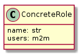
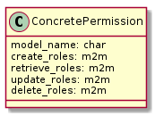

## Concrete Roles and Concrete Permissions

**IMPORTANT:** Concrete Roles and permissions are only enabled if USE_CONCRETE_ROLES is True in settings

### Concrete Roles

`ConcreteRole` is a concrete datastore model that allows to attribute different permissions for users of the same level. (**admins and superusers don't have their permissions changed by the roles, that only affects simpleusers and managers of the platform.**)

Each instance of model ConcreteRole has a role name and a list of users.



`ConcreteRole` is associated (M2M) to [`ConcrerePremissions`](#ConcretePermissions) in order to set the permissions rules.

Note that concrete roles and permissions don't give additional permissions to a user, it only restricts his default permissions.

### <a name="ConcretePermissions"></a>Concrete permission

`ConcretePermission` is a concrete datastore model that allows to specify a set of permissions for each model of the datamodel definition, depending on the roles defined in ConcretRole. These permissions match with the **CRUD** operations (**C**reate, **R**etrieve, **U**pdate, **D**elete)



For simpleusers and managers, in order to perform a **CRUD** operation, a user must have a role allowed to perform this operation (see example below for more details).

### Example

Having three users, a `SimpleUser`, a `Manager_1` and a `Manager_2`.

Given a model `MyModel` with a `minimum_creation_level` set to manager, both of the managers are allowed to create new instances of  `MyModel`, while the simpleuser is not allowed to.

Two roles are now added:

-  **Creator**: having as users `SimpleUser` and `Manager_1`.
-  **Watcher**: having only `Manager_2` as a user.

We then add a new permission:

```json
{
    "model_name": "MyModel",
    "create_roles": {
        "roles": ["<Creator_uid>"]
    }
}
```

-  With this permission added, the only user that is allowed to create instances of `MyModel` is the `Manager_1` because he belongs to the `Creator` role.

-  Even if `Manager_2` has the minimum required level to create instances, he does not have the required role to do so.

-  The `SimpleUser` has a role of `Creator` that is allowed to create new instances, but he does not have the minimun level required by the model, so he cannot perform a create on this model.
